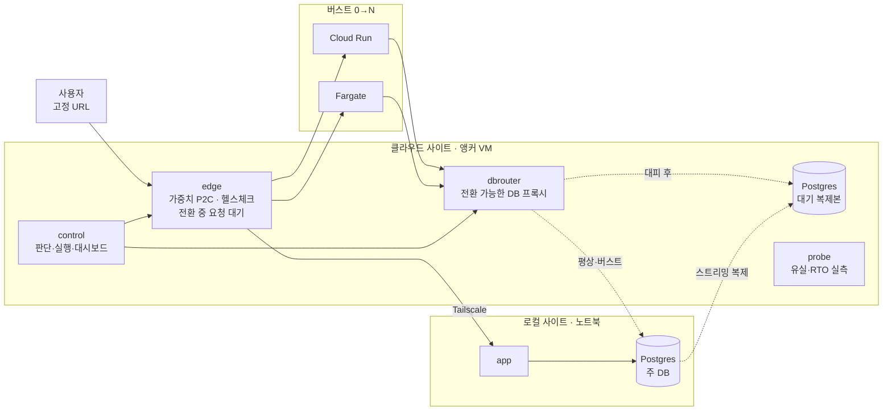

# Spillway

**평소엔 내 서버, 몰리면 클라우드가 붙고, 내 서버가 죽으면 클라우드로 대피한다.**

소규모 팀을 위한 하이브리드 클라우드 배포 시스템. 노트북이나 사내 서버 한 대를 주력으로 쓰다가, 트래픽이 한계를 넘으면 Cloud Run·Fargate 인스턴스를 붙여 넘치는 트래픽을 흘려보내고(버스팅), 로컬이 죽으면 클라우드의 대기 복제본을 승격해 서비스를 옮긴다(대피). URL은 하나로 고정되고, 전환 중인 요청은 에러 대신 잠시 대기한다.

> VMware Cloud on AWS가 기업에 파는 **버스팅 + 재해 복구**를, VMware도 Kubernetes도 없이 노트북 한 대로.

SoftBank Hackathon 2026 (테마: *One Action, Infinite Clouds*) 예선 제출물.

---

## 무엇이 되나

| 상황 | Spillway가 하는 일 | 사용자가 보는 것 |
|---|---|---|
| 평소 | 로컬 서버가 트래픽 100%, 클라우드에는 DB 대기 복제본만 | 로컬이 응답, 버스트 앱은 0개지만 앵커 VM·대기 DB 비용은 계속 발생 |
| 트래픽 폭주 | 백엔드 p95가 임계치를 넘으면 클라우드 인스턴스를 0→N개로 늘리고 가중치로 분담. 부하가 로컬 한계 아래로 내려가면 0개로 축소 | 응답 시간 정상화 |
| 로컬 앱만 장애 | DB는 그대로 두고 클라우드 앱이 트래픽을 넘겨받음 | 유실 없음 |
| **로컬 사이트 장애** (정전·네트워크 단절) | 클라우드 복제본 승격 → DB 라우터 전환 → 트래픽 100% 클라우드 | 몇 초 대기 후 계속 동작, 실패 응답 0 |
| 로컬 복귀 | 돌아온 옛 주 DB를 읽기 전용으로 격리(스플릿 브레인 방지) → 운영자 승인 시 페일백 | 전환 1~2초 대기 |
| 계획된 이사 | 쓰기를 멈추고 복제가 따라잡은 것을 확인한 뒤 전환 (RPO 0) | 전환 1~2초 대기 |

## 검증 결과 (단일 PC 시뮬레이션, E2E 자동 테스트)

`python scripts/e2e.py`가 아래 시나리오를 실제로 실행하고 측정한다. 최신 재검증 결과: [docs/verification-check.md](docs/verification-check.md). 이전 결과는 [docs/verification.md](docs/verification.md)에 보관했다.

| 시나리오 | 기본 (예열 0개) | 예열 1개 (`CLOUD_WARM_MIN=1`) |
|---|---|---|
| **버스트** — 로컬 한계(실측 124 rps)의 약 1.8배인 220 rps 투입 | 5.6초 뒤 버스트, 최대 3개, 요청 9,708건 중 **실패 0건**, 부하 종료 후 0개로 축소 | – |
| **긴급 대피** — 로컬 사이트 네트워크 차단 | 감지 8.9초 + 전환 4.4초, 사용자 무응답 13.7초, **실패 요청 0건 · 유실 0건** | 감지 8.4초 + 전환 **0.8초**, 무응답 **9.7초**, 실패 0 · 유실 0 |
| **대피 중 컨트롤 플레인 재시작** | 3.2초 만에 DB 역할에서 대피 상태 복원, 작업 로그 파일에서 복원 | 3.0초 |
| **로컬 복귀 → 페일백** | 옛 주 DB 자동 격리, 페일백 4.0초, 사용자 무응답 1초 미만, **유실 0건**, 3.0초 뒤 보호 재개 | 4.0초, 2.0초 뒤 보호 재개 |
| **계획된 이사** (무손실) | 전환 1.6초, 무응답 1.8초, **유실 0건 (RPO 0)** | – |
| **로컬 앱만 장애** | 5.6초 만에 클라우드 앱이 인계, DB 승격 없음, 유실 0건 | – |

최신 기본 시뮬레이션은 **17/17개 확인 항목 통과**. 비동기 복제의 긴급 대피 쓰기 유실은 측정·보고하되, 0건을 보장하지 않으므로 통과 항목에서 제외했다. 이전 예열 1개 구성은 별도 8개 항목을 통과했다. 단위 테스트는 `go test -race ./...` 통과.

긴급 대피 시간의 대부분은 **장애 감지**(헬스체크 연속 실패 + 오탐 방지 3초)다. 행사장 와이파이가 1~2초 끊겼다고 대피하면 안 되기 때문에 일부러 여유를 뒀다(`EVAC_AFTER`로 조절). 전환 자체는 예열 시 1초 미만이다.

> 실측은 모두 **한 대 PC의 Docker 시뮬레이션** 기준이다. GCP/AWS 배포 코드는 작성·정적 검증(`terraform validate`)까지 했고 실제 클라우드에서는 아직 실행하지 않았다. → [알려진 한계](#알려진-한계)

---

## 아키텍처



하나의 Go 바이너리(`spillway <subcommand>`)가 모든 역할을 한다.

| 컴포넌트 | 역할 |
|---|---|
| `edge` | 공개 진입점. 로컬/버스트 백엔드에 가중치 P2C 분배, 1초 헬스체크, 연결 실패 백엔드 즉시 제외, **전환 중 요청을 최대 30초 대기**, 연결 단계 실패·멱등 요청 재시도. 사용자 체감 시간과 백엔드 처리 시간을 따로 측정 |
| `control` | 1초마다 관측 → 모드 판단 → 단계별 실행. 모든 단계의 소요 시간을 감사 로그(JSON Lines)에 기록, 재시작 시 DB 역할로 상태 복원. 대시보드와 API |
| `siteagent` | 사이트별 Postgres 감독. 주 DB 초기화 / 복제본 클론, 역할·LSN·복제 지연 보고, 승격·쓰기 차단·재구성 |
| `dbrouter` | 버스트 인스턴스의 DB 접속점. 일시정지·연결 종료·대상 전환으로 앱 재시작 없이 주 DB를 바꿈 |
| `probe` | 0.2초마다 번호 붙은 쓰기 → 다시 읽어서 유실 건수, 성공 사이 최대 공백(사용자 체감 RTO) 측정. 부하 생성기 |
| `app` | 데모용 방명록. 응답마다 처리한 사이트 표시. 용량 제한(`WORK_MS`, `MAX_INFLIGHT`)으로 "작은 사내 서버"를 재현 |
| 버스트 어댑터 | GCP Cloud Run(서비스 최소 인스턴스), AWS Fargate(desiredCount, SigV4 서명), Docker(시뮬레이션) |

설계 배경, 결정 기록(ADR 15개), 구현하면서 바꾼 결정: **[docs/design.md](docs/design.md)**

---

## 빠른 시작: 한 대 PC 시뮬레이션

Docker만 있으면 된다. 로컬 사이트와 클라우드 사이트를 서로 다른 Docker 네트워크에 띄우고, 버스트 인스턴스는 컨트롤 플레인이 Docker API로 직접 만든다. 로컬을 네트워크에서 분리하면 "노트북 랜선을 뽑은" 상황과 같다.

```bash
./scripts/sim.sh up          # 빌드 + 실행 (약 1분)
```

- 사용자 화면: http://localhost:8080
- 관제 대시보드: http://localhost:8090

```bash
./scripts/sim.sh cut-local       # 로컬 사이트 네트워크 차단 → 자동 대피
./scripts/sim.sh restore-local   # 복구 → 대시보드에서 "페일백"
./scripts/sim.sh stop-local-app  # 로컬 앱만 장애
./scripts/sim.sh status          # 한 줄 상태
python scripts/e2e.py            # 전체 시나리오 자동 검증 → docs/verification.md
./scripts/sim.sh down            # 전부 삭제
```

부하는 대시보드의 **부하 테스트**(기본 220 rps)로 건다. 로컬 앱 용량은 3 동시 × 25ms 작업 ≈ 120 rps로 제한돼 있어서 버스트가 일어난다.

Windows에서는 Git Bash로 스크립트를 실행하면 된다.

## 실제 배포: 노트북 + GCP (+ AWS)

**[docs/deploy.md](docs/deploy.md)** — Tailscale 사설망으로 노트북과 GCP 앵커 VM을 잇고, Cloud Run(과 선택적으로 Fargate)을 버스트 대상으로 쓴다.

```
deploy/local   노트북: tailscale + Postgres 주 DB + 앱
deploy/cloud   앵커 VM: tailscale + edge + control + dbrouter + 대기 복제본 + probe
deploy/gcp     Terraform: 앵커 VM, Cloud Run(Direct VPC egress), Artifact Registry, IAM
deploy/aws     Terraform: ALB + ECS Fargate(Tailscale 사이드카), ECR, 제한된 IAM 사용자
```

## 데모

**[docs/demo.md](docs/demo.md)** — 최종 발표 3분 대본, 사전 점검, Q&A 대비.

---

## 설정

주요 환경 변수 (컨트롤 플레인). 전체 목록은 각 패키지의 `ConfigFromEnv`에 있다.

| 변수 | 기본값 | 의미 |
|---|---|---|
| `CLOUD_PROVIDERS` | `docker` | `cloudrun`, `ecs`, `docker` (쉼표로 여러 개, 인스턴스를 균등 분배) |
| `BURST_P95_HIGH_MS` / `BURST_P95_LOW_MS` | 250 / 120 | 버스트 시작 / 축소 기준 백엔드 p95 |
| `BURST_SUSTAIN` | 3s | 임계치 초과 지속 시간 |
| `BURST_MIN` / `BURST_MAX` | 2 / 6 | 버스트 시작 인스턴스 / 최대 |
| `BURST_STEP_COOLDOWN` / `BURST_SCALE_IN_AFTER` | 8s / 15s | 추가 확장 간격 / 축소 전 안정 시간 |
| `EVAC_AFTER` | 3s | 로컬 앱과 DB 에이전트가 모두 연결 불가한 상태가 이만큼 지속되면 자동 대피 |
| `EVAC_MIN` | 2 | 대피 시 최소 클라우드 인스턴스 |
| `CLOUD_WARM_MIN` | 0 | 평상시에도 트래픽 0%로 켜둘 인스턴스(대피 시간 단축, 비용 발생) |
| `AUTO_EVACUATE` | true | 자동 대피 (대시보드에서도 전환) |
| `LOCAL_UNITS` | 2 | 로컬의 상대 처리 용량(버스트 인스턴스 1개 = 1) |
| `SPILLWAY_TOKEN` | (없음) | 모든 컴포넌트의 변경 API 보호 토큰 |
| `EVENT_LOG` | (없음) | 감사 로그 파일 경로 (Compose 예시는 `/data/audit.jsonl`) |

## API

컨트롤 플레인 (`:8090`, 변경 요청은 `X-Spillway-Token` 헤더):

| 메서드 | 경로 | 동작 |
|---|---|---|
| GET | `/api/state` | 전체 상태 (모드, 사이트, 엣지, 제공자, 프로브, 작업 기록, 이벤트, 시계열) |
| POST | `/api/migrate` | 클라우드로 계획된 이사 (RPO 0) |
| POST | `/api/failback` | 로컬로 페일백 |
| POST | `/api/burst/on` · `/api/burst/off` | 수동 버스트 |
| POST | `/api/auto-evacuate` `{"enabled":bool}` | 자동 대피 켜기/끄기 |
| POST | `/api/sync-replication` `{"on":bool}` | 동기 복제 켜기/끄기 |
| POST | `/api/load` `{"rps":220,"seconds":45}` · `/api/load/stop` | 부하 생성 |
| POST | `/api/probe/reset` | 프로브 측정 초기화 |

## 개발

Go 툴체인이 없어도 Docker로 빌드·테스트할 수 있다.

```bash
docker run --rm -v "$PWD:/src" -w /src golang:1 go test -race ./...
docker run --rm -v "$PWD:/src" -w /src golang:1 go vet ./...
```

```
cmd/spillway/        단일 바이너리 진입점
internal/edge        엣지 프록시
internal/control     컨트롤 플레인 + 대시보드(dashboard.html)
internal/siteagent   Postgres 감독
internal/dbrouter    전환 가능한 TCP 프록시
internal/probe       유실/RTO 측정 + 부하 생성
internal/app         데모 앱 (page.html)
internal/cloud       Cloud Run / Fargate / Docker 어댑터
internal/metrics     슬라이딩 윈도 백분위
deploy/              sim · local · cloud · gcp · aws
scripts/             sim.sh · e2e.py · push-images.sh · deploy-anchor.sh
docs/                설계 · 배포 · 데모 · 검증 결과
```

## 기존 솔루션과의 차이

| | VMware Cloud on AWS | AWS DRS | Liqo | Coolify/Kamal | **Spillway** |
|---|---|---|---|---|---|
| 버스팅 | ✅ | ❌ | ✅ | ❌ | ✅ |
| 재해 복구 | ✅ | ✅ | 일부 | ❌ | ✅ |
| 단위 | VM | 서버 디스크 | Pod | 컨테이너 | **앱 + DB 분리** |
| 버스트 대상 | 상시 VM 호스트 | – | K8s 노드 | – | **서버리스(평소 0개)** |
| 전제 | VMware + SDDC | 에이전트 + AWS | K8s 클러스터 2개 | 서버 | **노트북 + Docker** |

## 알려진 한계

- **실제 클라우드 미검증.** Cloud Run·Fargate 어댑터와 Terraform은 코드 작성과 정적 검증까지만 했다. 첫 실제 배포는 [docs/deploy.md](docs/deploy.md)의 문제 해결 표를 참고.
- **긴급 대피의 RPO**: 비동기 복제라 이론상 마지막 몇 건이 유실될 수 있다(프로브로 실측, 시뮬레이션 0건). 계획된 이사·페일백은 RPO 0. 동기 복제 스위치 제공.
- **앵커 VM은 단일 장애점**: 로컬 장애는 견디지만 앵커 VM 장애는 견디지 못한다.
- **범위**: 앱 1개, Postgres 1개. 파일 스토리지, 여러 앱은 제외.
- **페일백은 전체 재복제**(`pg_basebackup`): DB가 크면 오래 걸린다. `pg_rewind`로 개선 가능.
- **AI 미적용**: 의도적으로 인프라 뼈대부터 만들었다. [design.md 8장](docs/design.md#8-ai-적용-보류)
