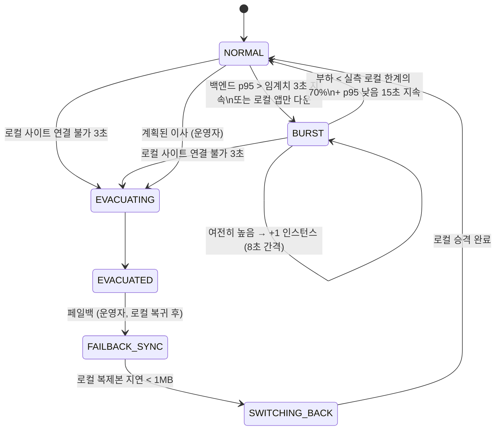
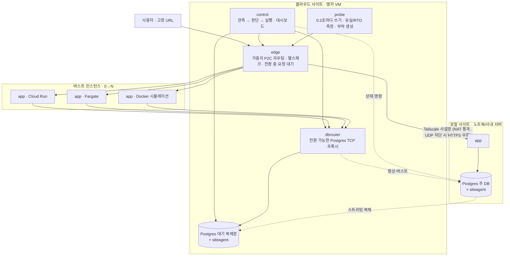

# Spillway 설계 문서

> **평소엔 내 서버, 몰리면 클라우드가 붙고, 내 서버가 죽으면 클라우드로 대피한다.**
> VMware Cloud on AWS가 하는 버스팅과 DR을, VMware 없이 노트북 한 대로.

- 대회: SoftBank Hackathon 2026 예선 1 · 테마 *One Action, Infinite Clouds*
- 문서 상태: 구현 반영본. 초기 설계(Notion 초안)에서 바뀐 결정은 **[변경]** 으로 표시.
- 관련 문서: [검증 결과](verification.md) · [실제 배포](deploy.md) · [데모 진행](demo.md)

---

## 1. 배경과 문제

### 1.1 풀고 싶은 문제
서버 한두 대(사무실 PC, 온프레미스 장비, 노트북)로 서비스를 운영하는 소규모 팀은 두 가지 순간에 무너진다.

1. **트래픽이 몰릴 때** — 장비를 늘릴 수 없다.
2. **장비가 죽을 때** — 대체할 곳이 없다.

그렇다고 처음부터 전부 클라우드로 가면 평소에도 비용이 나가고, 데이터가 사내를 떠나고, 이미 가진 장비가 논다.

### 1.2 엔터프라이즈는 이미 한다
| 제품 | 버스팅 | 대피(DR) | 한계 |
|---|---|---|---|
| VMware Cloud on AWS (+HCX, Site Recovery) | ✅ | ✅ | VMware 라이선스, SDDC, 전용 연결, 전문 인력 |
| AWS Elastic Disaster Recovery | ❌ | ✅ (RTO 분 단위, RPO 초 단위) | 서버 디스크 블록 복제 |
| Azure Site Recovery | ❌ | ✅ | VM 단위 |
| Liqo (Kubernetes) | ✅ | 일부 | K8s 클러스터 2개 전제 |
| Coolify / Dokploy / Kamal | ❌ | ❌ | 롤백은 코드만, 서버 이동 시 재구성 |

→ **기업용·K8s용은 있지만, K8s 없이 서버 한 대로 쓰는 소규모 팀용은 비어 있다.**

### 1.3 로컬을 주력으로 두는 이유
- **비용**: 평소 클라우드 비용 ≈ 대기 복제본 VM 1대. 버스트 인스턴스는 몰릴 때만 과금.
- **데이터 주권**: 주 DB는 사내에 있다. 클라우드에는 대기 복제본만 있다.
- **기존 장비 활용**: 이미 가진 서버·GPU 장비를 버리지 않는다.

---

## 2. 목표 / 비목표

### 목표 (모두 구현됨)
- 로컬 앱 하나에 대해 **평상 / 버스트 / 대피 / 페일백**을 자동·수동으로 오간다.
- 모든 전환 중 **URL은 하나로 고정**되고, 사용자는 에러 대신 짧은 대기만 겪는다.
- 대피 성능을 **숫자로 측정**한다: 사용자 체감 RTO, 유실된 확인 응답 쓰기 수.
- 같은 구조로 **여러 버스트 대상**(GCP Cloud Run, AWS Fargate, 로컬 시뮬레이션용 Docker)에 대응한다.

### 비목표
- 여러 앱 동시 관리, 파일 스토리지 동기화, 스키마 버저닝, 예측 기반 선제 버스트.
- AI 기능: 뼈대 완성 후 별도 검토 (8장).

### 배포 입구와 런타임의 경계
- 킥오프에서 요구하는 **로컬 웹앱의 원터치 배포**를 위해 `scripts/deploy_webapp.py`를 추가했다. Dockerfile이 있는 상태 없는 HTTP 앱을 Docker 또는 Cloud Run에 배포한다. 로컬에서는 후보 헬스체크 후 교체하며 실패 시 이전 이미지를 복구한다. Cloud Run 경로는 프로젝트 부재로 모의 테스트까지만 했다.
- 아래 버스팅·Postgres 대피 런타임은 **내장 방명록 앱**에 대해 설계·검증했다. 임의의 배포 앱에 DB 복제와 장애 대피가 자동 적용되지는 않는다. 이것은 제출 때 밝혀야 할 제품 경계다.
- 배포 서비스가 앱 자체보다 평가 대상이라는 킥오프 기준에 맞춰, 데모 첫 장면은 `source → build → readiness → URL`의 실제 실행으로 구성한다.

---

## 3. 동작 모드

| 모드 | 상황 | 로컬 | 클라우드 |
|---|---|---|---|
| **NORMAL 평상** | 평소 | 트래픽 100%, **주 DB** | 앱 0개(또는 예열 N개, 트래픽 0%), DB 대기 복제본 |
| **BURST 버스트** | 백엔드 p95가 임계치 초과 3초 지속, 또는 로컬 앱만 응답 없음 | 계속 처리, 주 DB 유지 | 앱 N개, 트래픽 분담 |
| **EVACUATING → EVACUATED 대피** | 로컬 앱·DB 에이전트 모두 3초 이상 연결 불가 | 라우팅 제외(격리) | 복제본 승격 → 주 DB, 트래픽 100% |
| **FAILBACK_SYNC → SWITCHING_BACK 페일백** | 운영자 승인 | 클라우드의 복제본으로 재구성 → 따라잡기 → 승격 | 쓰기 차단 → 로컬의 복제본으로 재구성 |
| (계획된 이사) | 운영자 버튼 | 쓰기 차단 후 복제 지연 0 확인 | 승격 → 트래픽 100% (**RPO 0**) |

---

## 4. 아키텍처

### 4.1 컴포넌트 (단일 Go 바이너리 `spillway <subcommand>`)

| 컴포넌트 | 역할 | 구현 |
|---|---|---|
| `edge` | 고정 URL. 로컬/버스트 백엔드에 가중치 분배, 1초 헬스체크, 연결 실패 시 즉시 제외(수동 헬스체크), 전환 중 요청을 최대 30초 **대기**, 연결 단계 실패·멱등 요청 재시도 | `internal/edge` |
| `control` | 1초마다 관측 → 모드 판단 → 단계별 실행·기록. 대시보드와 API 제공 | `internal/control` |
| `siteagent` | 사이트별 Postgres 감독. 주 DB 초기화/복제본 클론, 상태(역할·LSN·복제 지연) 보고, 승격·쓰기 차단(fence)·재구성 | `internal/siteagent` |
| `dbrouter` | 버스트 인스턴스의 DB 접속점. 일시정지(새 연결 대기)·기존 연결 종료·대상 전환 | `internal/dbrouter` |
| `probe` | 0.2초마다 번호 붙은 쓰기 → 다시 읽어 **유실 건수** 계산, 성공 사이 최대 공백 = **사용자 체감 RTO**, 부하 생성기 | `internal/probe` |
| `app` | 데모용 방명록. 응답마다 처리한 사이트 표시, 멱등 쓰기, 용량 제한(`WORK_MS`, `MAX_INFLIGHT`) | `internal/app` |
| 버스트 어댑터 | Cloud Run(서비스 최소 인스턴스), ECS Fargate(desiredCount, SigV4), Docker Engine API | `internal/cloud` |

### 4.2 핵심 설계 원칙
- **버스트 인스턴스는 DB에 직접 붙지 않는다.** 항상 `dbrouter`를 거친다. 대피할 때 앱을 재시작하지 않고 연결 대상만 바꾼다.
- **트래픽은 엣지로만 들어온다.** 대피 후 로컬은 요청을 받을 수 없다. 돌아온 옛 주 DB는 즉시 읽기 전용으로 격리한다. (스플릿 브레인 방지)
- **컨트롤 플레인은 로컬에 두지 않는다.** 로컬이 죽어도 판단할 주체가 살아 있어야 한다.
- **모든 전환은 "대기 → 전환 → 재개" 3박자.** 엣지와 dbrouter가 요청과 연결을 붙잡는 동안 DB 역할을 바꾸므로, 사용자는 에러 대신 지연을 본다.
- **판단은 백엔드 처리 시간으로, 표시는 사용자 체감 시간으로.** 전환 중 대기 시간이 과부하로 오인되지 않는다.

---

## 5. 핵심 흐름

### 5.1 버스트
1. 엣지가 요청마다 **백엔드 처리 시간**과 **사용자 체감 시간**을 따로 기록한다(6초 창).
2. 백엔드 p95 > 250ms가 3초 지속되면 버스트. 버스트 대상에 `BURST_MIN`개 요청.
3. 인스턴스가 헬스체크를 통과하면 가중치(`units`)가 붙어 트래픽을 받는다. 분배는 **P2C**: 가중치로 두 후보를 뽑고 단위당 처리 중 요청이 적은 쪽으로 보낸다. 포화된 로컬 서버에 대기열이 쌓이지 않는다.
4. 로컬이 포화된 동안의 로컬 처리량을 **로컬 한계(rps)** 로 실측한다.
5. 계속 높으면 8초 간격으로 +1 (최대 `BURST_MAX`).
6. 전체 부하 < 로컬 한계 × 0.7 이고 p95가 낮은 상태가 15초 지속되면, 클라우드 가중치 0 → 5초 뒤 인스턴스 축소(0개 또는 예열 수).

### 5.2 긴급 대피 (자동)
조건: 로컬 앱 헬스체크 실패 **그리고** 로컬 DB 에이전트 연결 불가가 3초 지속 (로컬이 한 번이라도 정상이었던 뒤에만).

| # | 단계 |
|---|---|
| 1 | 엣지 일시정지 — 새 요청을 붙잡음 |
| 2 | 버스트 대상에 `max(EVAC_MIN, 현재)`개 요청 (병렬 진행) |
| 3 | 엣지 라우팅에서 로컬 제외 (격리) |
| 4 | dbrouter 일시정지 + 끊긴 로컬 DB 연결 정리 |
| 5 | 클라우드 복제본 승격 `pg_promote()` |
| 6 | dbrouter 대상 → 클라우드 DB, 재개 |
| 7 | 버스트 인스턴스 헬스체크 통과 대기 |
| 8 | 엣지 재개 — 붙잡아 둔 요청이 클라우드로 |

### 5.3 계획된 이사 (무손실)
긴급 대피와 같되, 4단계 대신 **dbrouter 대기 → 진행 중 쿼리 마무리 → 연결 종료 → 로컬 DB 쓰기 차단 → 클라우드 복제본 LSN ≥ 로컬 LSN 확인** 후 승격한다. 마지막 쓰기까지 복제된 것을 확인하므로 **RPO 0**.

### 5.4 페일백
1. 로컬 DB를 클라우드 DB에서 베이스 백업으로 재구성(복제본) → 스트리밍, 지연 < 1MB.
2. 엣지·dbrouter 대기 → **클라우드 주 DB 쓰기 차단 확인** → 로컬 LSN ≥ 클라우드 LSN 확인 (**RPO 0**).
3. 로컬 승격 확인 → dbrouter → 로컬. 승격 전 실패는 DB 역할을 다시 확인한 뒤 클라우드로 원상복구하고, 승격 후 상태가 불확실하면 요청을 재개하지 않는다.
4. 엣지에 로컬 재편입, 클라우드 가중치 0 → 재개.
5. 클라우드 DB를 로컬의 복제본으로 재구성 → **보호 재개**.

### 5.5 로컬 앱만 장애
앱 헬스체크는 실패하지만 DB 에이전트는 응답하면, DB는 승격하지 않고 버스트로 처리한다. 클라우드 앱이 dbrouter → 로컬 주 DB로 트래픽을 받는다. 데이터 손실 가능성이 없는 경로를 먼저 쓴다.

---

## 6. 설계 결정 (ADR)

### ADR-01. 엣지 프록시 — 직접 구현 (Go) **[변경: Caddy/Envoy 후보 → 직접 구현]**
- **배경**: 앱 위치와 무관하게 URL을 고정하고, 비율 분배와 전환 중 요청 대기가 필요하다.
- **선택지**: (A) Cloudflare LB (B) Caddy/Envoy/HAProxy 설정 (C) 직접 구현
- **결정**: C
- **이유**: 핵심 기능인 "전환 중 요청 대기(hold)", 백엔드 처리 시간과 사용자 체감 시간의 분리 측정, 런타임 API(가중치·일시정지)는 기성 프록시로는 설정 조합이 복잡하거나 불가능하다. Go 표준 라이브러리로 약 500줄에 구현.
- **알려진 한계**: 엣지 VM이 단일 장애점. 여유가 있으면 DNS 수준 이중화.

### ADR-02. 터널 — Tailscale
- **선택지**: (A) WireGuard 직접 (B) Tailscale / Headscale
- **결정**: B. NAT 통과, UDP가 막힌 네트워크(행사장 와이파이)에서 DERP(HTTPS) 중계로 우회.
- **구현**: 각 사이트의 모든 서비스가 Tailscale 컨테이너의 네트워크 네임스페이스를 공유. Fargate는 커널 권한이 없어 userspace 모드 + SOCKS5(`DB_SOCKS5`)로 DB에 접속.

### ADR-03. DB 복제 — 물리 스트리밍 복제
- DB 전체를 대기시키기 쉽고 승격이 간단하다. 양쪽 Postgres 버전(16)과 이미지를 우리가 통제한다.
- 복제 슬롯 대신 `wal_keep_size=1GB`: 죽은 복제본이 슬롯을 붙잡아 로컬 디스크를 채우는 위험을 피한다.

### ADR-04. 동기 vs 비동기 복제
- **결정**: 기본 비동기, 대시보드에서 동기 복제를 켤 수 있음(`synchronous_standby_names='*'`).
- **이유**: 동기는 WAN 왕복이 모든 쓰기에 붙는다. 대신 **계획된 이사·페일백은 비동기에서도 RPO 0**이 되도록 "쓰기 차단 → LSN 동일 확인" 절차를 넣었다. 비동기의 손실 가능성은 **긴급 대피에만** 남고, 그 크기는 프로브가 실측한다.

### ADR-05. 버스트 대상 — 어댑터 인터페이스
- `Scale(n)` / `Status()` 두 메서드. Cloud Run은 **서비스 수준 최소 인스턴스**(새 리비전 없이 변경, 실패 시 템플릿으로 대체), Fargate는 `desiredCount`, 시뮬레이션은 Docker Engine API.
- 여러 제공자를 동시에 쓰면 인스턴스를 균등 분배한다(`CLOUD_PROVIDERS=cloudrun,ecs`).

### ADR-06. 버스트 중 DB 접근 — 로컬 주 DB 직결 (dbrouter 경유)
- 읽기 복제본을 쓰면 방금 쓴 글이 안 보이는 일관성 문제가 생긴다.

### ADR-07. 스플릿 브레인 방지
- 트래픽 유입을 엣지로 한정 → 대피 후 로컬은 요청을 못 받는다.
- 로컬 DB가 돌아오면 컨트롤 플레인이 **자동으로 읽기 전용 격리**(`default_transaction_read_only=on` + 기존 세션 종료).
- 주 DB 복귀는 페일백(재구성 → 계획된 전환)으로만 한다.
- 제3의 판정자는 엣지+컨트롤 플레인(클라우드). 로컬은 스스로 승격하지 않는다.

### ADR-08. 버스트 판단 지표 **[변경: 사용자 p95 → 백엔드 p95]**
- **초안**: p95 지연 + 히스테리시스 + 쿨다운.
- **구현하며 발견한 문제**: 전환 중 요청 대기 시간(1~14초)이 p95에 섞여 페일백 직후 **가짜 버스트**가 발생.
- **결정**: 판단은 엣지가 따로 측정한 **백엔드 처리 시간 p95**로 한다. 전환 직후 8초는 부하 판단을 멈춘다. 사용자 체감 p95는 대시보드 표시용.

### ADR-09. 축소 판단 — 실측 로컬 한계 **[신규]**
- **문제**: 버스트 시작 시점의 RPS를 로컬 한계로 쓰면, 측정 창에 평상시 트래픽이 섞여 한계를 절반으로 과소평가했다. (실측 63 rps, 실제 약 120 rps)
- **결정**: 로컬 그룹의 백엔드 p95가 임계치를 넘는 동안(= 포화) 관측된 **로컬 처리량의 최댓값**을 한계로 쓴다. 전체 부하가 그 70% 아래로 떨어질 때만 축소한다.
- **결과**: 시뮬레이션에서 한계 125 rps 실측(이론값 120), 부하 중 축소 없음.

### ADR-10. 분배 알고리즘 — 가중치 P2C **[신규]**
- **문제**: 가중치 무작위 분배는 포화된 로컬에도 계속 몫을 보내 대기열(수백 건)이 쌓였고, 그 여파로 인스턴스를 5개까지 과잉 확장했다.
- **결정**: 가중치로 두 후보를 뽑고 **단위당 처리 중 요청**이 적은 쪽으로 보낸다(동점이면 첫 후보). 유휴 시에는 설정한 비율을 따르고, 부하 시에는 사용률을 맞춘다.
- **결과**: 같은 부하(220 rps)에서 최대 인스턴스 5 → 3, 안정 후 p95 25ms.

### ADR-11. PgBouncer 대신 dbrouter **[변경]**
- PgBouncer는 런타임에 대상 호스트를 바꾸려면 설정 파일 재작성 + RELOAD가 필요하고, 컨테이너 간 파일 공유가 생긴다.
- 필요한 것은 풀링이 아니라 "일시정지 / 연결 종료 / 대상 전환" 세 동작뿐이라 약 200줄의 TCP 프록시로 구현. 앱 쪽 커넥션 풀(pgx)이 풀링을 맡는다.

### ADR-12. 쓰기 멱등성 **[신규]**
- 전환 중 연결이 끊긴 쓰기를 재시도하면 중복 저장될 수 있다.
- 프로브 쓰기는 `(client_id, seq)` 유니크 인덱스 + `ON CONFLICT DO NOTHING`, 요청에 `Idempotency-Key` 헤더. 엣지는 이 헤더가 있으면 POST도 다른 백엔드로 재시도한다.

### ADR-13. 예열 인스턴스 옵션 **[신규]**
- 긴급 대피 시간의 대부분이 버스트 인스턴스 기동이었다(시뮬레이션 약 5.7초).
- `CLOUD_WARM_MIN=N`이면 평상시에도 N개를 트래픽 0%로 켜둔다. 비용 ↔ RTO 트레이드오프이며, 수치는 [검증 결과](verification-warm.md)에 비교했다.

### ADR-14. 컨트롤 플레인 재시작 시 상태 복원 + 감사 로그 **[신규]**
- **문제**: 모드와 작업 기록이 메모리에만 있어서, 대피 중 컨트롤 플레인이 재시작되면 "평상"으로 초기화되고 트래픽을 죽은 로컬로 보내려 했다.
- **결정**: 모드의 진실은 DB 역할에 있다. 시작 시 클라우드 DB가 쓰기 가능한 주 DB면 대피 상태를 복원한다(로컬 격리, dbrouter → 클라우드, 인스턴스 확보). 모든 이벤트와 단계별 작업 기록은 JSON Lines 파일(`EVENT_LOG`)에 추가 기록하고 시작 시 다시 읽는다. 대회 예시의 "배포 관련 작업 로그 기록 및 저장"에 해당한다.
- **검증**: E2E에서 대피 상태로 컨트롤 플레인 컨테이너를 재시작해 복원 시간과 로그 복원을 확인한다.

### ADR-15. 왜 Kubernetes / Liqo를 쓰지 않는가
- Liqo는 로컬→클라우드 오프로딩을 공식 지원하지만 **양쪽 모두 K8s 클러스터**가 전제다. 대상은 서버 한 대, 노트북 한 대를 가진 팀이다.

---

## 7. 측정 지표

| 지표 | 측정 방법 |
|---|---|
| 버스트 반응 시간 | 부하 시작 → 모드 BURST |
| 로컬 한계 | 로컬 포화 중 처리량 최댓값 (ADR-09) |
| **사용자 체감 RTO** | 프로브의 성공한 쓰기 사이 최대 공백 (대기된 시간 포함) |
| **유실 쓰기** | 확인 응답(201)을 받았는데 DB에서 다시 읽히지 않는 순번 (2회 연속 누락 시 확정) |
| 전환 단계별 시간 | 컨트롤 플레인이 단계마다 ms 기록 |
| 버스트 비용 | 준비된 인스턴스 × 초 × 단가 (`COST_PER_INSTANCE_SECOND_KRW`, 추정) |

실측값은 [verification.md](verification.md) 참고.

---

## 8. AI 적용 (보류)

- 뼈대 완성을 우선했다. AI는 **넣을 필요가 분명한 자리가 생기면** 검토한다.
- 판단 기준: "그거 규칙 몇 줄로 되는 거 아니에요?"라는 질문을 통과하는가.
- 후보: 이벤트 로그·단계 기록을 근거로 한 장애 원인 요약, 앱 등록 시 구성(용량·헬스체크 경로) 분석.

---

## 9. 알려진 한계

- **실제 클라우드 미검증**: GCP/AWS 어댑터와 Terraform은 문법·스키마 검증(`terraform validate`)까지만 했다. 실측 수치는 모두 단일 PC 시뮬레이션 기준이다.
- **긴급 대피의 RPO**: 비동기 복제라 이론상 마지막 몇 건이 유실될 수 있다(시뮬레이션 실측 0건). 필요하면 동기 복제로 전환.
- **엣지/앵커 VM 단일 장애점**: 로컬 장애는 견디지만 앵커 VM 장애는 견디지 못한다.
- **단일 앱·단일 DB**: 파일 스토리지와 여러 앱은 범위 밖.
- **페일백은 전체 재복제**: `pg_rewind` 대신 베이스 백업을 쓴다. DB가 크면 느리다.

---

## 10. 아이디어 탐색 이력

| 순서 | 검토한 방향 | 결과 | 이유 |
|---|---|---|---|
| 1 | AI 배포 제어면 | 폐기 | AI를 먼저 붙이니 "AI가 뭘 해주나"로 흘러 차별성 약화 |
| 2 | 상태 있는 앱을 어느 환경으로든 옮기는 배포 | 폐기 | 에이전트에게 "서버에 올려줘"와 차별점 약함 |
| 3 | 실행 행동 관찰 + 트래픽 재생으로 동일성 검증 | 보류 | AI 의존도 높고 데모 임팩트 약함 |
| 4 | 라이브 마이그레이션 | 부분 채택 | 부품은 존재(pg-zdm, Karmada, Liqo) → **계획된 이사** 기능으로 흡수 |
| 5 | AI를 빼고 인프라 가치로 방향 설정 | 채택 | AI는 필요한 자리에만 |
| 6 | 후보 11개 탐색 | 탐색 | 버스팅, 무중단, 에어갭, 데이터 롤백 등 |
| 7 | 엔터프라이즈 기술의 소규모 재해석 | 채택 | Tailscale·Vercel·Kamal이 검증한 공식 |
| 8 | DB 버저닝 + 라이브 마이그레이션 | 보류 | PlanetScale Rewind, pgroll이 이미 구현 |
| 9 | **클라우드 버스팅 + 대피** | **채택** | 로컬과 클라우드를 동시에 쓰는 구조, 엔터프라이즈 원본은 있고 소규모판은 비어 있음 |
